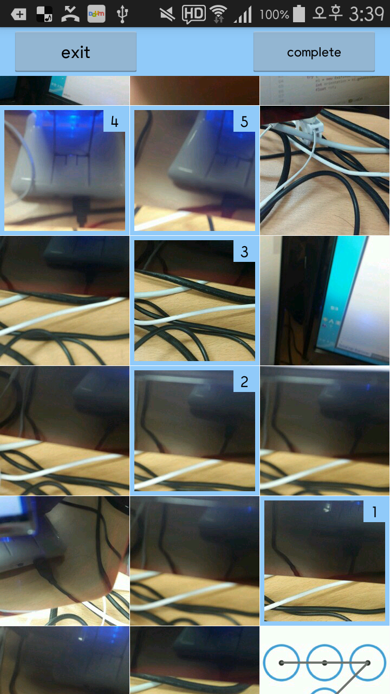

ColaPicker
=====
ColaPicker is so simple library for multiple image picker from your android device.
it's with glide. so fast , simple :)
Surpport select picture index labeling.

###ScreenShot


###Download
```gradle
repositories {
  ...
  maven { url "https://jitpack.io" }
}

dependencies {
  ...
  compile 'com.github.colabearstudio:colapicker:1.0.2'
}
```

###Start ColaActivity
```java
private final int REQUEST_PICK_IMAGE = 2;

Intent i = new Intent(this, ColaActivity.class);
i.putExtra(ColaActivity.EXTRA_LIMIT_COUNT, 10);
startActivityForResult(i, REQUEST_PICK_IMAGE);
```

###Result Handling
```java
protected void onActivityResult(int requestCode, int resultCode, Intent data) {
        super.onActivityResult(requestCode, resultCode, data);

        if(requestCode == REQUEST_PICK_IMAGE){
            if(resultCode == RESULT_OK) {
                Parcelable[] parcelableUris = data.getParcelableArrayExtra(ColaActivity.EXTRA_IMAGE_URIS);
                if (parcelableUris != null) {
                    Uri[] uris = new Uri[parcelableUris.length];
                    System.arraycopy(parcelableUris, 0, uris, 0, parcelableUris.length);

                    updateImages(uris);
                }
            }
        }
    }
```

###Customize

###With
[Glide](https://github.com/bumptech/glide/)
